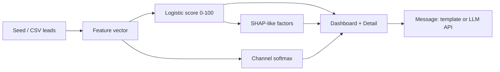

# LeadPilot

**ML lead prioritization · channel recommendation · personalized first-touch · explainability**

Diploma SaaS MVP: score every lead 0–100, pick the best channel, draft the first message, show why.

## Quick start

```bash
npm install
npm run dev
# open http://localhost:3000
```

```bash
npm run build   # must exit 0
npm start
```

### Optional LLM messages

```bash
export OPENAI_API_KEY=sk-...
# or
export ANTHROPIC_API_KEY=...
```

Without keys, `/api/generate` returns polished templates (still sellable).

## Stack

- Next.js App Router + TypeScript + Tailwind v4
- shadcn/ui · Recharts · Zustand (+ localStorage) · sonner
- Scoring & channel models encoded as **JS coefficients** (no Python on Vercel)

## Architecture



| Module | Role |
|--------|------|
| `src/lib/score.ts` | Priority + channel + factor contributions |
| `src/lib/messages.ts` | Template personalization + LLM prompt |
| `src/lib/seed-leads.ts` | 64 synthetic B2B leads |
| `src/lib/eval-metrics.ts` | Frozen offline AUC / lift / precision |
| `src/store/leads-store.ts` | Persist leads, outcomes, settings |
| `src/app/api/generate/route.ts` | OpenAI / Anthropic / template fallback |

## Product routes

- `/` — marketing landing + pricing ($49 / $149 / $399)
- `/app` — ranked inbox
- `/app/leads/[id]` — score, channel probs, message editor, explainability, outcomes
- `/app/import` — CSV import
- `/app/metrics` — ROC / lift / vs chronological baseline
- `/app/settings` — voice, language EN↔RU, API key note

## Models (summary)

Coefficients in `score.ts` document an offline path: **XGBoost → logistic calibration on synthetic CRM**. Runtime is a calibrated logistic regression (deployable on the Edge). Channel choice is softmax over hand-tuned utilities. See [SPEC.md](./SPEC.md) for limitations and privacy.

## Deploy

Designed for **Vercel Hobby**: static + serverless route only. Set env keys in the project settings if you want LLM copy.

## License

MIT — diploma / demo product.
