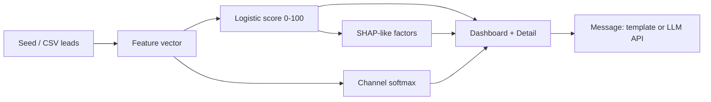

# LeadPilot

**ML lead prioritization · channel recommendation · personalized first-touch · explainability**

Diploma SaaS MVP: score every lead 0–100, pick the best channel, draft the first message, show why — in English and Russian.

## Quick start

```bash
npm install
npm run dev
# open http://localhost:3000
```

```bash
npm run build   # must exit 0
npm start
```

### Optional LLM messages

```bash
cp .env.example .env.local
# set OPENAI_API_KEY and/or ANTHROPIC_API_KEY
```

Without keys, `POST /api/generate` returns polished bilingual templates (still demo-ready).

## Features

- **Priority score (0–100)** — calibrated logistic surrogate of offline XGBoost
- **Channel recommendation** — email / call / LinkedIn / messenger via softmax utilities
- **First-touch messages** — templates or OpenAI/Anthropic; EN ↔ RU voice
- **Explainability** — signed factor contributions with bilingual labels
- **Ranked inbox** — search, channel/industry/source filters, min-score slider, `/` + Esc shortcuts
- **CSV import** — map common CRM columns and score on the fly
- **Offline metrics** — ROC / lift / precision@K / vs chronological baseline
- **Settings** — company voice, product pitch, language, demo reset
- **Client demo store** — Zustand + `localStorage` (no DB required)

## Stack

- Next.js App Router + TypeScript + Tailwind v4
- shadcn/ui · Recharts · Zustand (+ localStorage) · sonner
- Scoring & channel models encoded as **JS coefficients** (no Python on Vercel)

## Architecture



| Module | Role |
|--------|------|
| `src/lib/score.ts` | Priority + channel + factor contributions |
| `src/lib/messages.ts` | Template personalization + LLM prompt |
| `src/lib/seed-leads.ts` | 72 synthetic B2B leads (varied industries/sources) |
| `src/lib/eval-metrics.ts` | Frozen offline AUC / lift / precision |
| `src/lib/factor-labels.ts` | RU+EN explainability labels |
| `src/store/leads-store.ts` | Persist leads, outcomes, settings |
| `src/app/api/generate/route.ts` | OpenAI / Anthropic / template fallback |

## Product routes

| Route | Purpose |
|-------|---------|
| `/` | Marketing landing + pricing ($49 / $149 / $399) |
| `/app` | Ranked inbox + keyboard-friendly filters |
| `/app/leads/[id]` | Score, channel probs, message, explainability, outcomes |
| `/app/import` | CSV import + sample download |
| `/app/metrics` | Offline eval charts |
| `/app/settings` | Voice, language EN↔RU, API key note |

## Models (summary)

Coefficients in `score.ts` document an offline path: **XGBoost → logistic calibration on synthetic CRM**. Runtime is a calibrated logistic regression (Edge-friendly). Channel choice is softmax over hand-tuned utilities.

### Offline metrics (frozen)

| Metric | Value |
|--------|-------|
| ROC AUC | 0.842 |
| Lift @ top 20% | 2.31× |
| Reply-rate lift | 1.64× |
| Holdout | n = 2400 synthetic |

See [SPEC.md](./SPEC.md) for limitations, privacy, and diploma thesis alignment.

## Deploy

Designed for **Vercel Hobby**: static + serverless route only. Set env keys in project settings for LLM copy.

## License

MIT — diploma / demo product.
