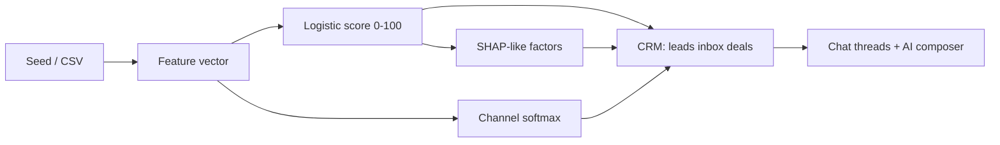

# LeadPilot

**ML lead prioritization inside a full sales CRM** — inbox, deals, chats, companies, tasks — with channel recommendation, personalized first-touch, and explainability.

Diploma SaaS MVP: score every lead 0–100, pick the best channel, draft/send messages in a real chat UX, manage pipeline — in English and Russian.

## Auth

Visit `/login` for magic link or email+password. First login creates a real Supabase workspace + owner membership and seeds default plugins. Anonymous use keeps the labeled Demo sample.

Public env: `NEXT_PUBLIC_SUPABASE_URL`, `NEXT_PUBLIC_SUPABASE_ANON_KEY`, `NEXT_PUBLIC_DATA_BACKEND` — see `docs/SUPABASE.md`.

## Quick start

```bash
npm install
npm run dev
# open http://localhost:3000
```

```bash
npm run build   # must exit 0
npm start
```

### Optional LLM messages

```bash
cp .env.example .env.local
# set OPENAI_API_KEY and/or ANTHROPIC_API_KEY
```

Without keys, `POST /api/generate` returns polished bilingual templates (still demo-ready).

## CRM modules

| Route | Purpose |
|-------|---------|
| `/` | Marketing landing + pricing |
| `/app` | Overview KPIs, top leads, recent chats |
| `/app/inbox` · `/app/inbox/[threadId]` | Unified inbox + full chat |
| `/app/leads` | ML-ranked lead list |
| `/app/leads/[id]` | Lead 360: score, channel, chat, explainability, timeline, deal stage |
| `/app/companies` | Accounts |
| `/app/deals` | Kanban pipeline (New → Won/Lost) with drag-and-drop |
| `/app/tasks` | Follow-ups |
| `/app/metrics` | Offline eval charts |
| `/app/import` | CSV import |
| `/app/settings` | Voice, language EN↔RU, demo reset |

## Differentiator (diploma)

- **Priority score (0–100)** — calibrated logistic surrogate of offline XGBoost
- **Channel recommendation** — email / call / LinkedIn / messenger via softmax
- **First-touch + chat composer** — templates or OpenAI/Anthropic; EN ↔ RU
- **Explainability** — signed factor contributions with bilingual labels

## Stack

- Next.js App Router + TypeScript + Tailwind v4
- shadcn/ui (Sidebar, Message, Bubble, …) · Recharts · Zustand (`leadpilot-crm-v1`) · @dnd-kit · sonner
- Scoring & channel models encoded as **JS coefficients** (no Python on Vercel)

## Architecture



| Module | Role |
|--------|------|
| `src/lib/score.ts` | Priority + channel + factor contributions |
| `src/lib/messages.ts` | Template personalization + LLM prompt |
| `src/lib/seed-crm.ts` | ~40 leads, companies, 20+ threads, 12 deals, tasks |
| `src/lib/eval-metrics.ts` | Frozen offline AUC / lift / precision |
| `src/store/leads-store.ts` | Persist CRM entities + settings |
| `src/app/api/generate/route.ts` | OpenAI / Anthropic / template fallback |

### Offline metrics (frozen)

| Metric | Value |
|--------|-------|
| ROC AUC | 0.842 |
| Lift @ top 20% | 2.31× |
| Reply-rate lift | 1.64× |
| Holdout | n = 2400 synthetic |

See [SPEC.md](./SPEC.md) for limitations, privacy, and diploma thesis alignment.

## Deploy

Designed for **Vercel Hobby**: static + serverless route only. Set env keys in project settings for LLM copy.

## License

MIT — diploma / demo product.
