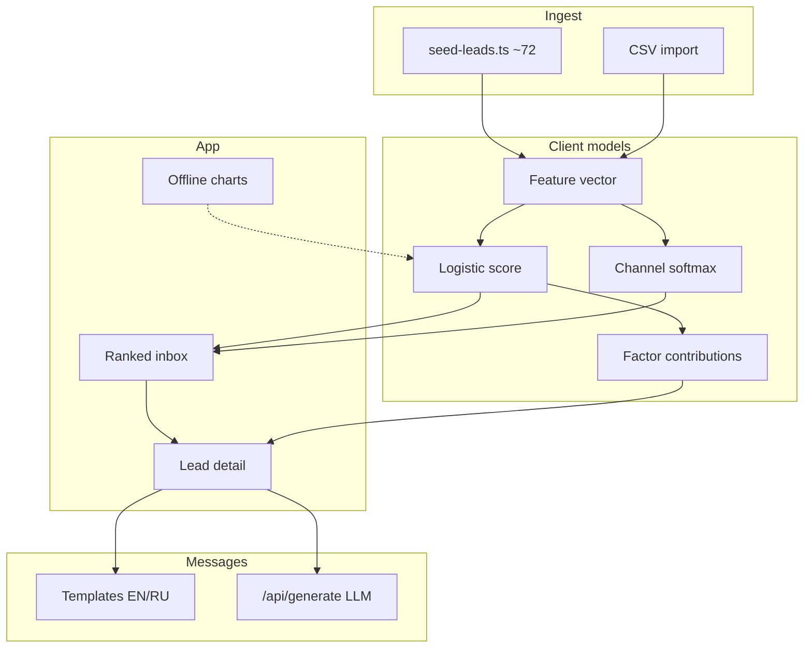

# LeadPilot — Diploma Product Specification

## Thesis alignment

**Machine Learning-Based System for Lead Prioritization, Communication Channel Recommendation, and Personalized Message Generation.**

LeadPilot is the sellable SaaS embodiment of that thesis: a sellable CRM with unified inbox, deals, chats, and tasks — differentiated by ML conversion scoring, best-channel recommendation, personalized first-touch copy, and SHAP-like explainability (EN + RU UI).

## Problem

B2B teams process leads chronologically or with crude rules. High-intent buyers wait while cold contacts consume SDR time. Channel choice is guesswork; first messages are generic.

## Product pipeline (per lead)

1. **Priority score (0–100)** — calibrated P(convert)
2. **Best channel** — `email | call | linkedin | messenger`
3. **Personalized first-touch message** — templates or LLM
4. **Explainability** — signed factor contributions (logistic surrogate of offline XGBoost)

## CRM data model (Zustand + localStorage `leadpilot-crm-v1`)

companies · leads (companyId, applyScore) · threads · messages · deals · tasks · activities

Seed: ~40 leads, 15–25 chat threads with SDR history, 12 deals across stages, tasks + timeline.

## Feature list (shipped MVP)

- Marketing landing with hero, problem/product, how-it-works, offline metrics, pricing
- CRM shell (shadcn Sidebar): Overview, Inbox/Chat, Leads, Companies, Deals kanban, Tasks, Metrics, Import, Settings
- Ranked leads with search, filters (channel / industry / source / min score), empty & loading states
- Unified inbox with unread badges, multi-message threads, AI composer
- Keyboard: `/` focuses search; `Esc` clears search or filters
- Lead detail: score, probability, channel mix, editable message, copy toast, regenerate, outcomes
- Bilingual explainability factor labels (RU + EN)
- CSV import with sample file
- Metrics page: ROC-style curve, lift, vs chronological baseline, precision@K
- Settings: company voice, pitch, language, demo reset
- Optional LLM generation via server env keys

## Architecture

```
CSV / seed CRM  →  feature vector  →  JS logistic score + channel softmax
                                   →  message generator (/api/generate)
                                   →  Zustand + localStorage UI
```



- **Frontend:** Next.js App Router, TypeScript, Tailwind v4, shadcn/ui, Recharts
- **State:** Zustand persisted to `localStorage` (`leadpilot-crm-v1`)
- **Scoring:** Pure TypeScript (`src/lib/score.ts`) — no Python on Vercel
- **Messages:** `POST /api/generate` uses OpenAI/Anthropic if env keys exist; else templates (`src/lib/messages.ts`)

## Models (diploma-friendly)

### Priority model

Offline training narrative: synthetic B2B CRM (~12k rows) → XGBoost ranker → **logistic calibration**. Coefficients exported into `WEIGHTS` / `INTERCEPT` in `score.ts`. Runtime = sigmoid(linear terms). Display score = probability × 100.

Features: demo requested, budget signal, email opens / open rate, site visits, recency, log company size, seniority, source, industry (incl. EdTech / Cybersecurity), country tier.

### Channel model

Softmax over channel utilities (engagement → email, exec+phone+demo → call, LinkedIn presence/source → linkedin, regional/SMB → messenger).

### Explainability

Linear term contributions of the logistic surrogate (SHAP-like for this model class). Positive/negative bars on the lead detail page with bilingual labels via `factor-labels.ts`.

### Offline metrics (frozen)

From `src/lib/eval-metrics.ts` on synthetic holdout (n = 2400):

| Metric | Value |
|--------|-------|
| AUC | ≈ 0.842 |
| Lift @ 20% | ≈ 2.31× vs chronological baseline |
| Reply-rate lift | ≈ 1.64× |
| Model top-20% conversion | ≈ 19.8% (baseline ≈ 8.6%) |

These figures are **precomputed** for the diploma narrative — not live production telemetry.

## Pages

| Route | Purpose |
|-------|---------|
| `/` | Marketing: problem → product → how → metrics → pricing |
| `/app` | Ranked leads dashboard + filters |
| `/app/leads/[id]` | Score, channel, message, explainability, outcome |
| `/app/import` | CSV import |
| `/app/metrics` | Offline eval charts |
| `/app/settings` | Company voice, language EN/RU, API note |

## Pricing (marketing)

Starter $49 · Growth $149 · Scale $399 / month

## Seed data

`createSeedLeads(72)` — deterministic PRNG (`mulberry32(20260916)`). Industries: SaaS, FinTech, Healthcare, Logistics, Retail, Manufacturing, EdTech, Cybersecurity, Other. Sources: inbound, outbound, webinar, referral, linkedin, cold. Mixed geographies and seniority.

## How to run

```bash
npm install
npm run dev      # http://localhost:3000
npm run build    # production build — must exit 0
npm start
```

Optional: copy `.env.example` → `.env.local` and set `OPENAI_API_KEY` / `ANTHROPIC_API_KEY`.

## Limitations

- Demo store is **client-side only** (`localStorage`); not multi-user CRM sync
- Coefficients are from **synthetic** CRM — recalibrate on customer data before production claims
- LLM generation optional; quality depends on API keys and prompts
- Outcome marking is a **feedback-loop stub** (stored locally, not yet used for online learning)
- Channel model is utility/softmax, not a separately trained multi-class production model
- Offline metrics are frozen demo numbers, not recomputed from the 72 seed rows

## Privacy

- Lead data stays in the browser (`localStorage`) for the demo
- API keys must be server env vars (`OPENAI_API_KEY` / `ANTHROPIC_API_KEY`) — **never** written to localStorage
- `/api/generate` only sends lead fields needed for copywriting when a key is present
- No third-party analytics baked into the MVP

## i18n

English default UI with Russian toggle (diploma author is RU speaker). Explainability factor keys are translated at render time.

## Deploy target

Vercel Hobby — static assets + one serverless route for message generation.
